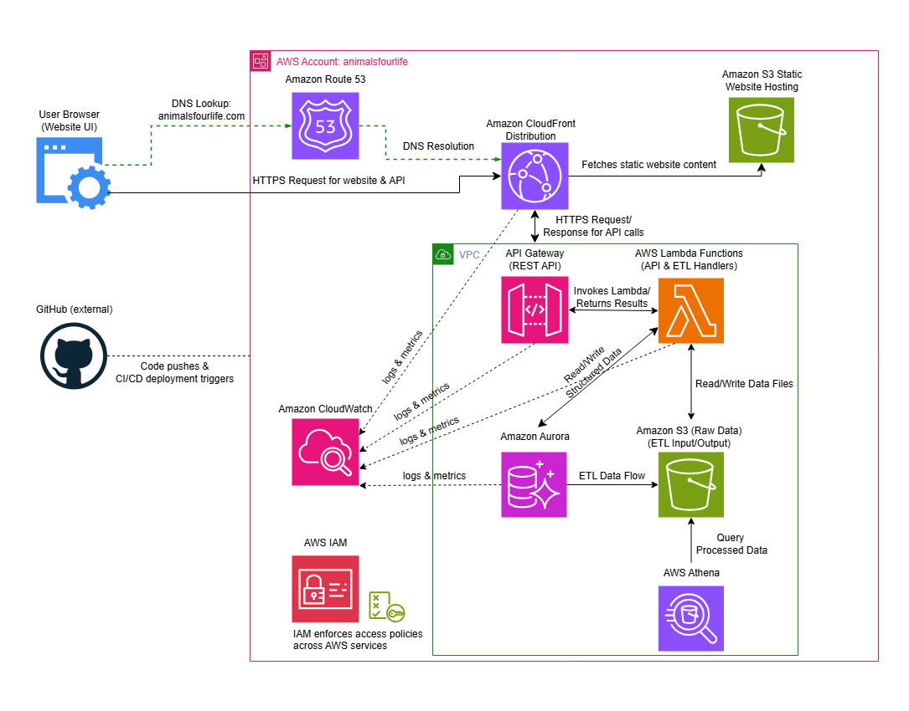

# animalsfourlife

A project showcasing a serverless AWS architecture for an animal data website.
It features a static website hosted on S3 with CloudFront CDN, API Gateway & Lambda functions for backend processing, and data storage & analytics with Amazon Aurora, S3, Athena, and a secure VPC setup.

---

## Project Overview

Static website hosting via Amazon S3 with CloudFront CDN

REST API implemented through API Gateway backed by AWS Lambda functions

Primary data storage using Amazon Aurora Serverless v2 within private subnets, with ETL processes exporting data to S3 for analytics via Athena

Amazon S3 buckets for raw and processed data storage, accessed securely via private VPC endpoints

Virtual Private Cloud (VPC) configuration with public and private subnets, Internet Gateway, and route tables

VPC Endpoint for S3 to enable private S3 access without exposure to the internet

IAM roles and policies ensuring secure Lambda execution and controlled resource access within the VPC

CloudWatch monitoring and logging for Lambda functions, API Gateway, CloudFront distributions, and database activity

Security groups restricting database and Lambda access by IP address and subnet

Infrastructure as Code managed through AWS CloudFormation YAML templates

---

## Architecture Diagram



---

## Getting Started

### Prerequisites

- AWS Account with proper permissions  
- AWS CLI configured with your credentials 
- Git installed  
- Node.js installed (for frontend build tools, if applicable)
- Basic familiarity with AWS services (VPC, Lambda, RDS, IAM)

### Installation

Clone the repo:

```bash
git clone https://github.com/mleib1337/animalsfourlife.git
cd animalsfourlife
```

---

### Deploying Infrastructure

Deploy the CloudFormation stack which provisions:

VPC with public and private subnets

Internet Gateway and route tables

Aurora Serverless v2 cluster in private subnets

DB subnet group and security groups

Lambda execution role with necessary IAM permissions

Lambda function configured to run within the private subnets

S3 VPC Endpoint for private access to S3

API Gateway setup connected to Lambda backend

Use the AWS CLI or AWS Console to deploy the stack, passing parameters for database username, password, and allowed IP CIDR.

Example AWS CLI command:

``` bash
aws cloudformation deploy \
  --template-file infrastructure.yaml \
  --stack-name animalsfourlife-stack \
  --parameter-overrides DBUsername=admin DBPassword=YourSecurePassword123 MyIp=203.0.113.0/24 \
  --capabilities CAPABILITY_NAMED_IAM
```

---

### Development

Backend Lambda code is located under /lambda folder

Frontend static assets are hosted in the /frontend folder and deployed to S3

Infrastructure changes should be made to the CloudFormation YAML template in /infrastructure.yaml

---

### Monitoring & Security

Logs and metrics are available in CloudWatch

Aurora DB and Lambda function are secured by security groups allowing access only from specified IP ranges and VPC subnets

S3 buckets use VPC Endpoint to avoid exposure to the public internet

IAM roles follow least privilege principles, granting only required permissions

---

## Future Additions (Coming Soon)

Planned features and enhancements:

✅ API Gateway integration: Connect API Gateway to trigger Lambda functions for handling frontend requests.

✅ Expanded IAM roles: Grant fine-grained permissions for access to Amazon Aurora, S3, and other services.

✅ Raw data S3 bucket: Create a non-hosting S3 bucket for raw data ingestion and archival.

✅ CloudWatch alarms & alerts: Configure monitoring and alerts across services once multiple components are generating logs.

✅ Athena query integration: Enable serverless querying of processed data stored in S3 for analytics and insights.

✅ CI/CD integration: Implement automated deployment workflows using GitHub Actions to deploy infrastructure and application changes to AWS.